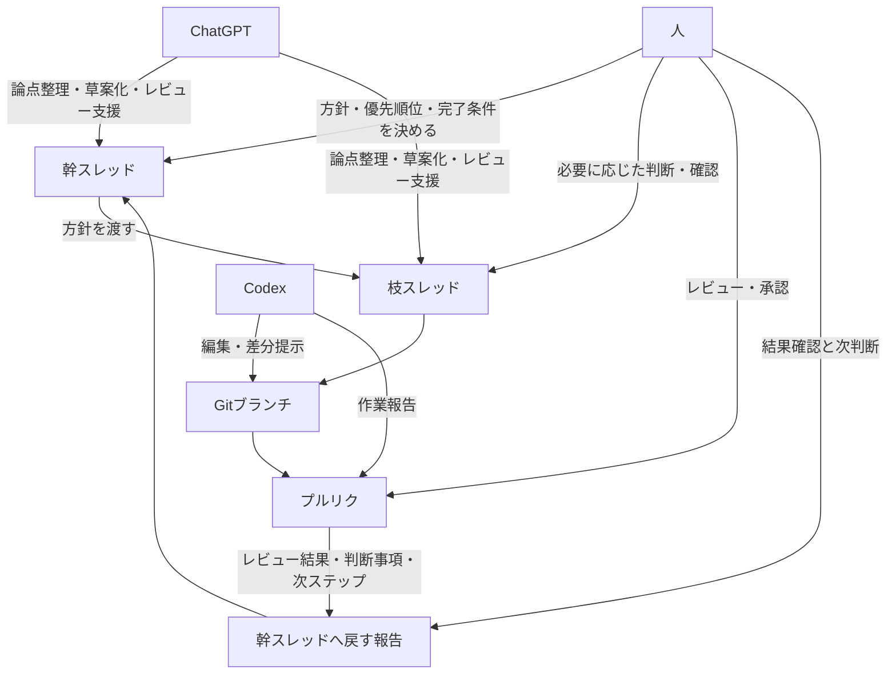

# 01 運用モデル図

この図は `docs/00_project_playbook.md` の補助図です。主フロー（幹スレッド → 枝スレッド → Gitブランチ → プルリク → 幹スレッドへ戻す報告）と、人 / ChatGPT / Codex の関わり方を分けて示します。

- 主フローは中央の縦方向で、運用の流れを上から下へ追える構成です。
- 人は主フローの外側から、判断・確認・承認の主体として関与します。
- ChatGPT は幹スレッドと枝スレッドを主に支援し、整理と草案化を担います。
- Codex は Gitブランチとプルリクに対して、編集・差分提示・作業報告を担います。
