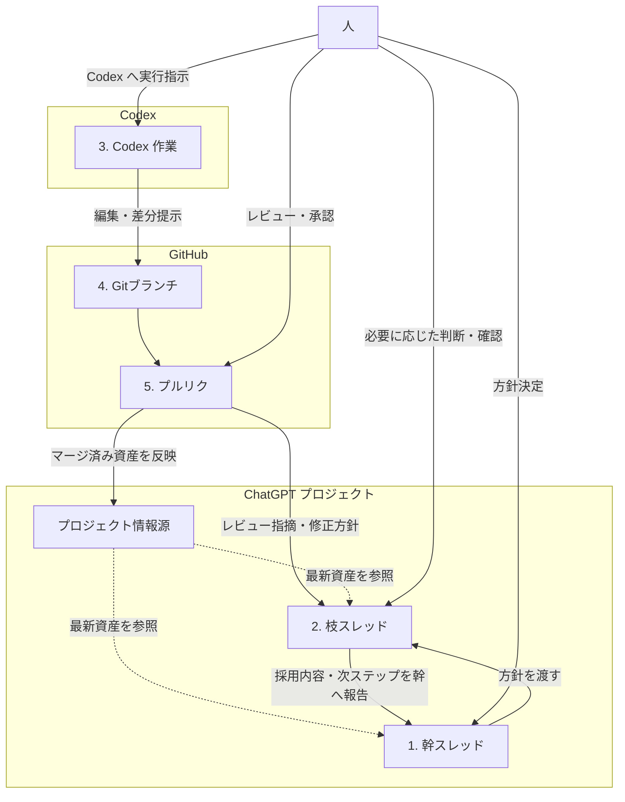

# 01 運用モデル図

この図は `docs/00_project_playbook.md` の補助図です。作業の場（ChatGPT プロジェクト / Codex / GitHub）と、運用の主フロー（1. 幹スレッド → 2. 枝スレッド → 3. Codex 作業 → 4. Gitブランチ → 5. プルリク）に加えて、マージ後の資産反映と、幹スレッド・枝スレッドが参照する共有情報源の関係を分けて示します。

- ChatGPT プロジェクト / Codex / GitHub の3つを、作業の場として分けて配置しています。
- 幹スレッドと枝スレッドは ChatGPT プロジェクト上の場として扱い、主フローは 1〜5 の番号順で上から下へ追える構成にしています。
- 人は外側に置き、方針決定・判断確認・レビュー承認の主体として関与します。
- レビュー差し戻し時は枝スレッドで修正方針を再整理し、同じ Gitブランチを更新します。
- 5. プルリクからプロジェクト情報源への線は自動同期ではなく、マージ後の成果物を運用ステップとして反映することを示しています。
- 枝スレッドは実行内容と修正方針を整理する場で、Codex への実行指示は人が行います。
- 幹スレッドへの確定報告は、枝スレッドで整理した採用内容と次ステップを戻す形で扱います。
