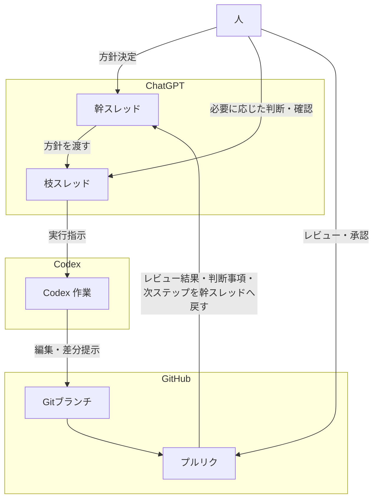

# 01 運用モデル図

この図は `docs/00_project_playbook.md` の補助図です。作業の場（ChatGPT / Codex / GitHub）と、運用の主フロー（幹スレッド → 枝スレッド → Codex 作業 → Gitブランチ → プルリク → 幹スレッドへ戻る）を分けて示します。

- ChatGPT / Codex / GitHub の3つを、作業の場として分けて配置しています。
- 幹スレッドと枝スレッドは ChatGPT 上の場として扱い、主フローは上から下へ追える構成にしています。
- 人は外側に置き、方針決定・判断確認・レビュー承認の主体として関与します。
- プルリクの結果は矢印ラベルで幹スレッドへ戻し、次の判断につなげます。
