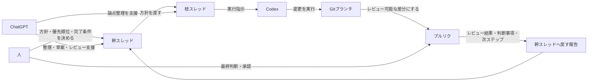

# 01 運用モデル図

この図は `docs/00_project_playbook.md` の補助図です。人 / ChatGPT / Codex と、幹スレッド / 枝スレッド / Gitブランチ / プルリク、そして幹スレッドへ戻す報告の関係を、運用全体の流れとして示します。

- 幹スレッドは、方針と最終判断を集約する起点です。
- 枝スレッドは、幹スレッドの方針を具体的なタスクに落とす作業の場です。
- Codex の実行結果は Gitブランチとプルリクに残し、レビュー可能な形で扱います。
- プルリクで得た結果は幹スレッドへ戻し、次の意思決定につなげます。
